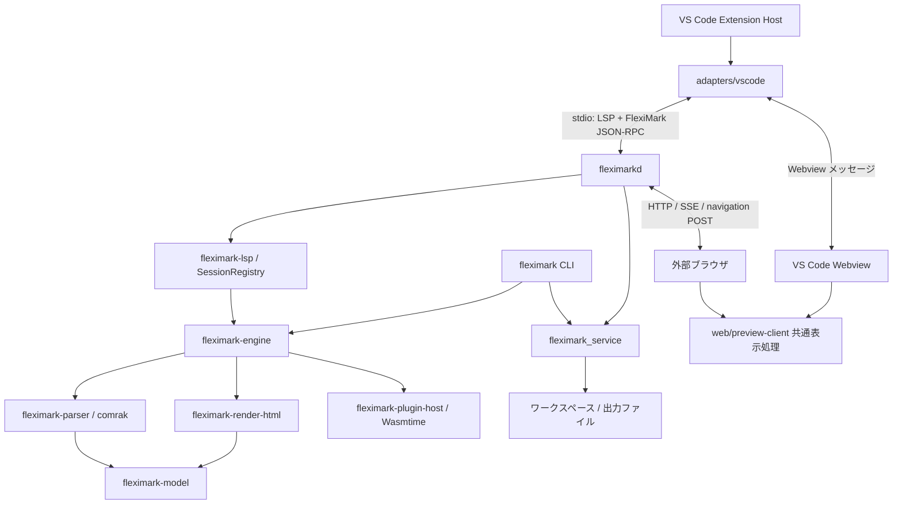
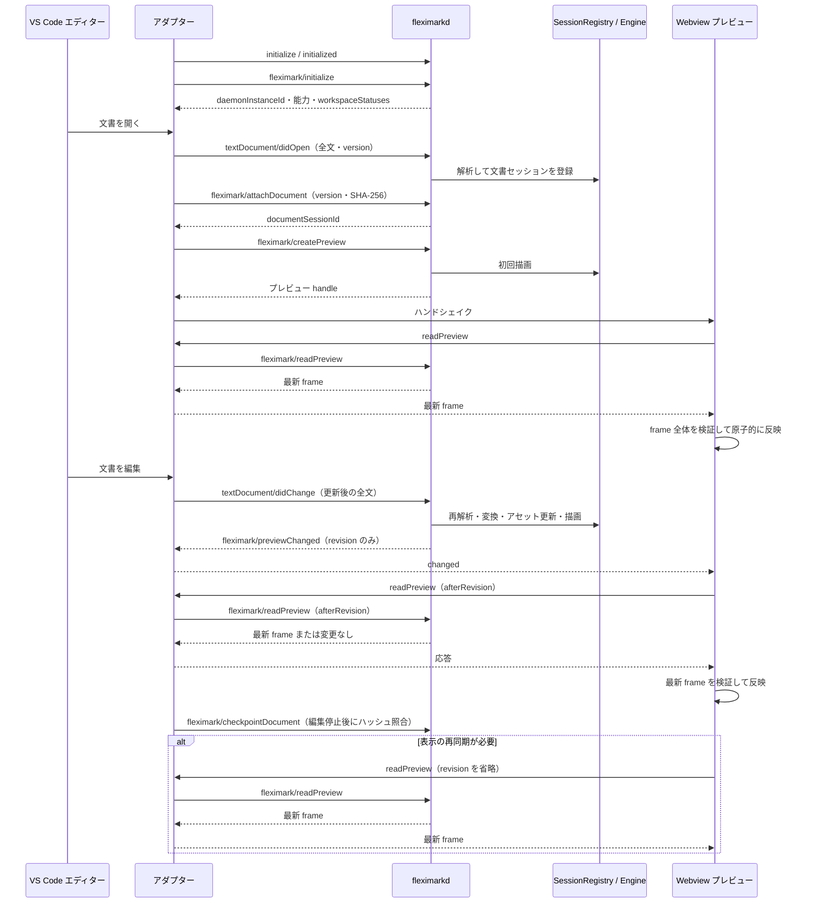
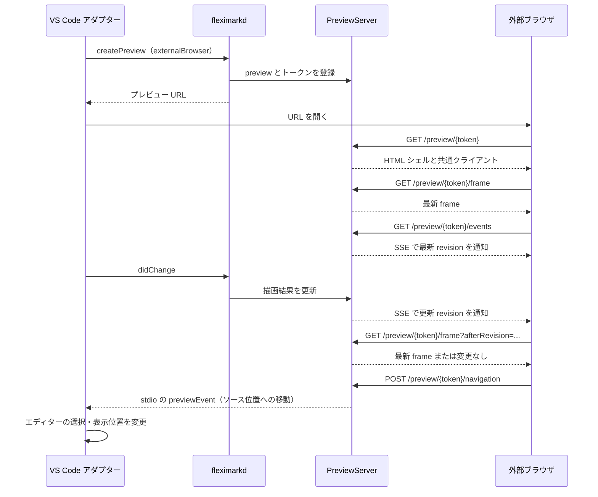
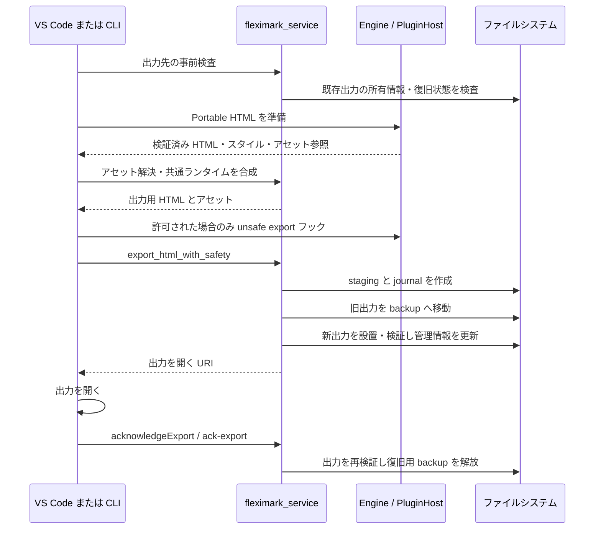

# FlexiMark アーキテクチャ

本書はリポジトリの実装・設定・テストを調査して記述した、現在の構成の説明である。

## 1. 全体構成と責務

FlexiMark は、Rust の文書処理基盤、VS Code 用 TypeScript アダプター、ブラウザで動く共通プレビュークライアントで構成される。Markdown の解析、文書モデル、レンダリング、ワークスペース操作は Rust 側が担う。VS Code は編集内容と操作をサービスへ伝え、プレビュークライアントは Rust が保持する最新の自己完結 frame を取得して表示する。

この図は主要な実行時の連携を表す。Cargo の全依存関係を列挙したものではない。特に `fleximark_service` は別パッケージではなく、`crates/fleximarkd/Cargo.toml` の `[lib]` で定義されたライブラリ名であり、デーモンと CLI から共有される。

| 配置                                 | 主な責務                                                                                 |
| ------------------------------------ | ---------------------------------------------------------------------------------------- |
| `adapters/vscode/src/`               | 拡張の起動、コマンド・言語機能の登録、デーモン監視、文書同期、Webview とエディターの連携 |
| `crates/fleximark-wire/`             | JavaScript と交換可能な整数型 `JsSafeU64` などの基礎的な通信型                           |
| `crates/fleximark-model/`            | `Document`、ブロック・インライン、NodeId、ソース位置と生成元情報、モデル検証             |
| `crates/fleximark-parser/`           | comrak の解析結果を FlexiMark の文書モデルへ変換                                         |
| `crates/fleximark-render-html/`      | 文書モデルからポリシーに従う HTML、ノード一覧、ナビゲーション情報を生成                  |
| `crates/fleximark-engine/`           | 文書セッション、解析・変換パイプライン、NodeId の維持、最新描画 frame                   |
| `crates/fleximark-lsp/`              | セッション登録、文書同期、位置変換・検索、ワークスペースとの対応管理                     |
| `crates/fleximark-protocol/`         | JSON-RPC フレーム、メソッドと要求・応答・通知の契約                                      |
| `crates/fleximark-protocol-codegen/` | Rust の通信契約から JSON Schema と TypeScript を生成                                     |
| `crates/fleximarkd/`                 | LSP/RPC サーバー、HTTP プレビュー配信、ファイル操作サービス                              |
| `crates/fleximark-cli/`              | レンダリング、ワークスペース操作、HTML 出力、ベンチマークの CLI                          |
| `crates/fleximark-plugin-sdk/`       | プラグイン契約、WIT、マニフェスト、ワークスペース設定型                                  |
| `crates/fleximark-plugin-host/`      | プラグインの検証・実行、権限制御、変換結果の検証                                         |
| `web/preview-client/`                | HTML の検証・適用、描画補助、ソースとの双方向ナビゲーション                              |

## 2. プロセスと通信契約

VS Code のエントリーポイントは `adapters/vscode/src/extension.mts`、配布時は `dist/extension.cjs` である。`FlexiMarkAdapter` が接続を統括し、`DaemonSupervisor` が `fleximarkd lsp` を子プロセスとして起動する。一つのアダプターが一つのデーモンを管理し、複数ルートのワークスペースはその接続内で扱う。アダプター側にはワークスペースごとの `WorkspaceRuntime` があり、文書とプレビューの状態を分けて保持する。

標準入出力では `Content-Length` フレームの JSON-RPC 2.0 を使う。LSP の `initialize` / `initialized` に続けて `fleximark/initialize` を呼び、プロトコルバージョン、クライアント能力、ワークスペース URI と信頼状態を交換する。VS Code は位置の符号化に UTF-16 を指定する。サービス側には UTF-8・UTF-16・UTF-32 の位置処理がある。

LSP は文書の開閉・更新、snippet 補完、Semantic Tokens、ホバー、文書シンボル、診断、コードアクションを受け持つ。補完カタログと FlexiMark 固有構文のトークン化は `fleximark-lsp` を正本とし、エディター固有の静的 snippet は持たない。Markdown と埋め込み言語の基礎的な字句強調にはエディター側の grammar を使い、FlexiMark 固有の意味的強調を Semantic Tokens で重ねる。FlexiMark 独自メソッドは文書への接続確認、プレビューの作成・読取り・明示的な再描画、選択・スクロール連携、ワークスペース再設定、ノート作成やエクスポートなどを受け持つ。`fleximarkd rpc` は LSP の文書通知を使わず、独自の open/change/close メソッドを提供する別の起動モードである。

`transport/stdio.rs` は入力読取と出力書込を別スレッドに置き、サーバーの要求処理をキューで直列化する。入力側でキャンセル情報を更新できるため、処理中のプラグイン実行や古い結果の公開を取り消せる。ログは標準エラーへ出力し、標準出力の RPC フレームと分離する。

通信型の正本は Rust 側にある。生成物は `schemas/protocol.schema.json` と `web/preview-client/protocol.generated.mts` で、アダプターとプレビューの双方がこの契約を利用する。実行時の受信値も検証する。`JsSafeU64` は Rust と JavaScript の整数精度の違いを通信境界で扱う。

## 3. 文書モデルとレンダリング

`Document` は URI、文書バージョン、メタデータ、ブロック列を保持する。ブロックは `NodeId`、種類、属性、子ノード、`SourceProvenance` を持つ。見出しやリストだけでなく、Mermaid、ABC 記譜、数式、admonition、tabs、details、メディア、プラグイン用ブロックもモデルに表現される。

解析は comrak で Markdown を読み、独自モデルへ変換して検証する。comrak の AST をそのまま外部へ渡す構成ではない。ソース範囲には UTF-8 のバイト位置などを持ち、生成・変換されたノードも生成元を追跡する。これをプレビューとエディターの位置対応に利用する。

文書更新時の処理順序は次のとおり。

1. プラグインが有効ならソースの前処理を実行する。
2. 全文を解析して新しい文書モデルを作り、前処理の位置対応を元ソースへ戻す。
3. 旧モデルと照合して NodeId を維持し、モデルを検証する。
4. プラグインのブロック変換、文書変換を順に適用し、結果を検証してセッションへ反映する。
5. 描画時にプラグインの描画モデル拡張を実行し、HTML と位置対応を生成する。

現在の実装は、更新後の全文を再解析したうえで最新の描画 frame を生成する。VS Code アダプターの `didChange` も、各編集で現在の全文を送信する。

エンジンはプレビューごとに最新の `RenderFrame` を一つ保存する。frame は revision、document version、順序付きブロック、renderer fingerprint、style、assets、annotations、navigation を含み、それ単体で表示を再構成できる。`readPreview` は保存済み frame を読むだけで revision を進めず、プラグインも再実行しない。文書更新または明示的な `rerenderPreview` が成功した時だけ新しい frame を採用する。

| 識別子・値            | 意味                                               |
| --------------------- | -------------------------------------------------- |
| `daemonInstanceId`    | 起動中のデーモンを識別し、再起動前の応答を区別する |
| `documentSessionId`   | デーモン上の開いている文書を識別する               |
| `documentVersion`     | 編集内容の世代を示す                               |
| `previewSessionId`    | 同じ文書に対する個々のプレビューを識別する         |
| `renderRevision`      | プレビューごとの描画世代を示す                     |
| `rendererFingerprint` | 描画条件の一致を判定し、DOM を再利用できるか決める |
| `NodeId`              | 文書モデルと描画されたブロックを対応付ける         |

文書の version と描画 revision は別物である。同じ文書でも複数のプレビューがあり、それぞれが独立した最新 frame を持つ。過去の frame 履歴は保持しない。

## 4. 編集からプレビュー更新まで

`document-coordinator.mts` は初回接続時とチェックポイントで本文の SHA-256 を送信する。チェックポイントは編集通知の後、150 ms の遅延でまとめる。version やハッシュが一致しない文書は同期不良として扱われ、`fleximark/requestFullText` により全文を再送できる。

プレビューは通知の受信口を設定してから最初の read を行う。クライアントは適用済み revision、通知で知った最大 revision、取得中かどうかだけを追跡し、一度に一件だけ frame を取得する。取得中に新しい通知が届けば、応答適用後にもう一度読む。アダプターは接続世代、デーモン ID、プレビューの生存状態を確認し、旧接続や破棄済み表示面の応答を捨てる。

デーモンが終了すると `DaemonSupervisor` が再起動を管理する。再接続後はプロトコルとワークスペースを初期化し、VS Code が保持する文書を再送し、プレビューを再作成する。旧セッション ID を無効化し、古い接続から遅れて届いた結果が新しい表示へ混入しないようにする。繰り返し失敗した場合は再試行やログ表示の UI を提示する。

## 5. 共通プレビューとブラウザ配信

`PreviewHost` は `PreviewDocument`、`PreviewEnhancer`、`PreviewNavigation` を組み合わせる。VS Code 用の `vscode-host.mts` と外部ブラウザ用の `browser-host.mts` は通信方法を分担し、共通の表示処理を使う。

`PreviewDocument` は frame 全体の HTML、ノード ID、アセット、位置対応、annotations、スタイルを検証してから原子的に反映する。renderer fingerprint、ブロック ID、以前受信した素の HTML が同じブロックは既存 DOM を再利用し、変更ブロックだけを置き換える。同じアセットには既存の object URL を再利用し、不要になった URL だけを解放する。同じ不正 frame を繰り返し受信した場合は自動再試行を止める。

`PreviewEnhancer` は Mermaid、abcjs、KaTeX による表示、YouTube、タブ、コード強調などを担当する。Rust が生成する構造と、ブラウザ内で実行する図・音楽・数式の描画を分けている。非同期描画の世代を確認し、更新・破棄時には音声などの資源を停止する。

外部プレビューの HTTP サーバーは Rust の `preview_http.rs` にあり、`127.0.0.1` の OS が割り当てるポートで待ち受ける。URL は推測困難なトークンを含む `/preview/{token}` である。

ブラウザの更新通知は EventSource/SSE、frame の取得は HTTP GET、逆方向の操作は HTTP POST である。再接続時は履歴を再生せず最新 frame を読む。SSE は未送信の通知を最新 revision へまとめ、sequence 順を維持する。Host / Origin、トークン、入力サイズなどを検査し、CSP を設定する。Webview 側はメッセージトークンとハンドシェイクを使う。

選択・スクロール連携ではソース範囲と NodeId の対応を利用する。エディターからは `setSelection` / `setViewport`、プレビューからはソース移動イベントを送る。アダプター側には、連携によって発生したエディターイベントをそのまま送り返すループを抑制する処理がある。

## 6. ワークスペースとファイル操作

`.fleximark/config.toml` は Rust サービスが読むワークスペース設定であり、ノートの命名・カテゴリ・テンプレート、アセットのルート、生 HTML の扱い、プラグイン設定を保持する。カテゴリは表示名と保存先から独立した一意 ID を持つ再帰木であり、同名カテゴリと親カテゴリへの保存を扱える。型は `fleximark-plugin-sdk`、スキーマは `schemas/config.schema.json` にある。テーマは `.fleximark/theme.css` を使う。

VS Code 設定はデーモンの場所、表示先、表示列、自動プレビュー、ログレベルなど、エディター統合に関わるものを担当する。旧 workspace migration は維持している。TypeScript は旧 VS Code 設定の読取り、確認 UI、表示先設定の更新を担当し、旧ファイルの検査、TOML 生成、テーマコピー、config を最後に書く処理は Rust サービスが担当する。既存ファイル保護とシンボリックリンク検査も Rust 側で行う。

ノート作成、admonition の収集、テーマ編集、初期化、エクスポートは `fleximark_service` がファイル操作を実施する。アダプターは対象ワークスペースや選択肢を決め、サービスの結果に含まれるメッセージや URI を UI へ反映する。設定の不備はワークスペースの状態として返され、複数ルートの各設定を個別に扱える。

VS Code 拡張は未信頼・仮想ワークスペースをサポート対象外として宣言している。サービス側にも信頼状態、ワークスペース内のパス、通常ファイルであること、シンボリックリンクなどの検証がある。ローカルアセットの解決はサービスで行い、クライアントへ任意のファイルシステムアクセスを委譲しない。

## 7. WebAssembly プラグイン

プラグインは Wasmtime の Component Model で実行する。WIT 契約は `crates/fleximark-plugin-sdk/wit/fleximark-plugin-v1.wit` にあり、API バージョン、フック名、JSON ペイロードを受け渡す。

サービスは `.fleximark/plugins` 内のマニフェスト・WASM・署名を読み、設定に固定されたマニフェストの SHA-256 と公開鍵、Ed25519 署名、マニフェスト内の WASM ハッシュを照合する。設定順に登録されたプラグインをホストが実行する。

フックはソース前処理、ブロック変換、文書変換、描画モデル拡張、エクスポート後段の HTML 変換に分かれる。前処理には元のソースへ戻す位置対応が必要で、モデル変換後もノード・深さ・生成元などを検証する。

ホストは付与された読み書きルートと環境変数をサンドボックスへ渡し、実行時間、fuel、メモリー、出力サイズ、ノード数、深さを制限する。キャンセルもホストを通して伝播する。通常のプレビューでは HTML ポリシーを適用し、危険な HTML 出力を許す特別な経路は明示的な権限を持つエクスポート用フックとして分離する。

## 8. HTML エクスポートと復旧

エクスポートは文書モデルから Portable 用 HTML を生成し、ローカルアセットを解決し、テーマと共通ブラウザランタイムを組み込む。既定の出力先は文書の隣の `<文書名>.fleximark-export` ディレクトリである。生 HTML はプレビューとエクスポートの双方で、実行・埋め込み・外部リソース読込みを除く決定的な許可リストにより既定で sanitize される。設定により escape または reject も選べる。

ファイルの更新は `export/filesystem.rs`、`journal.rs`、`model.rs`、`recovery.rs` に分かれる。出力の所有情報、ファイル内容のハッシュ、ファイルシステム上の同一性、追記型ジャーナルを使って、途中終了や予期しない置換を検出する。単純な HTML ファイルの上書きではなく、管理対象のディレクトリを段階的に更新する。

VS Code は出力 URI を開く処理が成功した後に `acknowledgeExport` を送る。これはユーザーによる目視確認を自動判定する仕組みではない。CLI では `ack-export` を別途実行する。ack 前には復旧用情報を残し、次の操作時の復旧と検証に利用する。

## 9. CLI・ビルド・検証

`fleximark` CLI はデーモンを RPC 経由で呼ぶのではなく、エンジンとサービスライブラリを直接利用する。`render`、`export`、`init`、`edit-theme`、`create-note`、`collect-admonitions`、`ack-export`、`benchmark` を提供する。ワークスペースへの書込みは `--trusted-workspace` を要求し、信頼指定のない通常の render はワークスペースプラグインを読み込まない。

`fleximarkd serve <document>` は別の簡易起動経路で、文書を一度読み込んで外部プレビュー URL を出力する。現在の経路にはファイル監視ループがなく、エディター連携によるライブ更新とは区別される。

ビルドは `mise.toml` と `scripts/tasks.py` が統括する。ブラウザクライアントを esbuild で生成してから Rust デーモンをビルドする。これはデーモンと CLI がブラウザ用 JavaScript を `include_str!` で取り込むためである。続いてデーモンを配布場所へ配置し、release manifest を生成し、拡張と Webview 用バンドルを作る。同梱デーモンの選択・検証はアダプターの `release-manifest.mts` が担う。

検証の主な境界は以下に対応する。

| 検証対象                                         | 実装・テストの所在                                                                       |
| ------------------------------------------------ | ---------------------------------------------------------------------------------------- |
| モデル、解析、latest frame、プラグイン、サービス | 各 Rust crate のテストと `crates/*/tests/`                                               |
| 通信契約と生成物の一致                           | `scripts/protocol_codegen.py`、`test/protocol-contract.test.mts`、独立した JSON fixtures |
| 接続復旧、複数ルート、文書・プレビューの生存期間 | `test/adapter/`                                                                          |
| frame 検証・DOM 再利用とホスト間の連携           | `test/preview-client.test.mts`、`browser-host.test.mts`、`vscode-host.test.mts`          |
| VS Code 統合                                     | `test/extension.test.mts` と Electron 実行環境                                           |
| 配布物・構成境界・性能                           | `scripts/verify_architecture.py`、リリース関連スクリプト、`check_performance_budgets.py` |

変更時には、文書処理は Rust のモデル・エンジン、エディター固有の操作はアダプター、表示効果は共通プレビュー、ファイルへの副作用はサービスという責務に沿って配置する。通信契約を変更する場合は Rust の定義と生成物、独立した契約テストを合わせて更新する。
