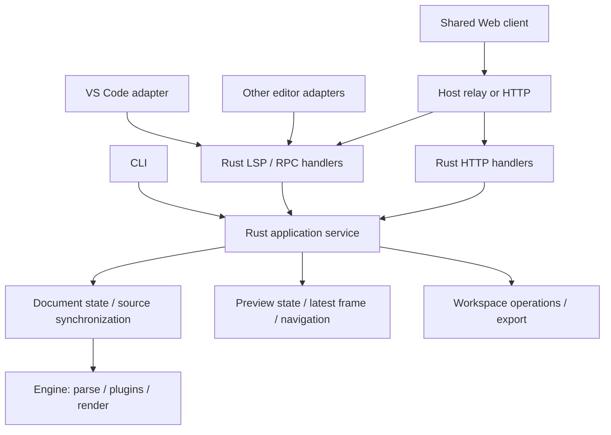

# コード量とアーキテクチャの複雑さを同時に減らすためのレポート

2026-09-21 再調査版。対象は `feat/kashiwade/big-update` の `50b7398`、比較元はローカル `main` の `a5518bb`。前回の `06be30e` 以降の数式・ABC プレビュー修正も確認した。main は対象 HEAD の祖先。リモートの更新は取得していない。

**結論と今回の設計条件**

必須条件は、①マルチエディター対応、②エディター非依存の処理を Rust で実行、③追加した Rust・接続コードを含めた手書き総行数の純減、④状態・契約・処理経路の複雑さの低減、の四つである。将来の再利用だけを理由に、現在の総量増加を最終成果として認めない。

最大の削減機会は、**連続する差分を各層で保持・中継・修復する方式を、Rust が保持する最新の描画結果を取得する方式へ変えること**にある。これに Rust 内で重複するユースケースの統合と、契約定義の整理を組み合わせる。既存機能を Rust へ一対一で翻訳しただけでは、コード削減にはならない。

推奨案は、描画結果を自己完結したブロック列として配信し、共通 Web クライアントが同一ブロックの DOM を再利用する方式である。初回表示・更新・再接続を一つの取得処理に統一できる。ただし全文相当の転送量を許容できるかは未計測であり、性能検証を採用条件とする。満たさない場合は、ルート直下に限定した小さい差分方式に留める。両方式を恒久的に併存させない。

第一段階の設計目標は、実行コードとツールを合わせた手書き 24,784 行から **1,500～2,500 行の純減（約6～10%）**。これは削除済み行数や確定見積りではなく、後述の削除対象と追加実装の収支を審査するための目標である。テスト削除、生成物の圧縮、機能廃止はこの目標の達成手段に含めない。

**再計測した増加量**

Git 差分全体は 293 ファイル、60,175 行追加、24,957 行削除、純増 35,218 行。以下は Git 内の `.rs/.mts/.ts/.js/.mjs/.py/.css` を集計した値である。

| 区分 | main | 現在の HEAD | 純増 |
| --- | ---: | ---: | ---: |
| Rust 実行コード相当 | 0 | 13,524 | +13,524 |
| TS/JS/CSS 実行コード相当 | 6,353 | 7,726 | +1,373 |
| ビルド・検証・生成ツール | 266 | 3,534 | +3,268 |
| テスト・fixture | 1,166 | 18,830 | +17,664 |
| 生成 TS・取り込んだ KaTeX CSS | 0 | 192 | +192 |
| 合計 | 7,785 | 43,806 | +36,021 |

実行コード相当は **6,353 → 21,250 行、約3.34倍**。現在の TS 側はアダプター 4,744 行、共通 Web クライアント 2,982 行。Rust 化しても TS/JS/CSS は約22%増えている。テスト・fixture は対象ソース純増の約49%を占めるが、main に不足していた保証を追加した分も含むため、全量を余剰とは評価しない。

集計は空行・コメント込みの物理行数。`test/`、`scripts/tests/`、`fixtures/`、Rust の `tests/`・`tests.rs`・`test_support.rs` と末尾の `#[cfg(test)] mod tests` をテスト扱いにした。散在するテスト専用関数は除去し切れていないため、実行コードは近似値である。protocol-codegen の非テスト部 1,265 行はツールに分類。JSON/YAML/TOML・文書・lockfile は表から除外し、生成 TS 189 行と今回追加された KaTeX CSS 3 行を別計上した。圧縮された一行の大きさを含め、行数だけで複雑さを測らない。

再現手順は `git ls-tree -r --name-only <ref>` で追跡ファイルを列挙し、`git show <ref>:<path>` の行数を上記規則で分類する。比較する ref は冒頭のコミットに固定する。コードの計測値は作業ツリーの文書変更を含まない。

**前回の提案から改める点**

前回は「Rust への移管に伴う総量増加を許容」としたが、今回は移行途中に限る。完成時には旧実装・旧契約を削除し、総量の純減も必要とする。新しい application service を既存層の上に積み増すだけの変更は採用しない。

前回の activate 方式は、push と差分履歴を残す場合の改善案である。今回は初回・更新・復旧を一つの read 処理に統一する案を優先し、activate/ack/reload の新しい組合せを増やさない。

また、[LSP registry の RPC 文書操作](W:/w/fleximark/crates/fleximark-lsp/src/lib.rs:424) はすでに LSP 側の open/change/close 実装へ委譲している。「LSP と独自 RPC の全文書処理を共通化すれば大幅に減る」とは計上しない。残る課題は、サービスの所在、前後のアセット更新・公開処理、セッション検証の責任である。

**実装から確認できた複雑さの発生源**

| 観察した箇所 | 現在の構造 | 削るべきもの |
| --- | --- | --- |
| TS の preview coordinator | 1,452 行。未対応通知のキュー、容量上限、reload marker、ready 待ち、候補採用、再作成 | 差分履歴と到着順を修復する制御 |
| Rust engine の render/session | preview ごとに blocks・revision・fingerprint を保持し、render/full を分岐 | 配信先ごとの旧描画への依存と重複した公開経路 |
| Rust HTTP 配信 | JSON 値・encoded 値・履歴・byte数・sequence・revision を保持 | 描画履歴の再生と圧縮処理 |
| daemon の変更公開 | 各 preview を描画し、履歴満杯なら Full を作り直して再配信 | overflow による再描画・再公開分岐 |
| 差分の wire 契約 | 5種類の操作、任意の親、3種類の挿入位置 | 実際の生成能力を超える操作体系 |
| navigation | HTTP は履歴 JSON から位置対応を取得、RPC は registry から解決 | 同じ操作に対する二つの意味処理 |
| export | CLI と daemon が複数の共通関数を別々に組み立てる | ユースケース手順の重複 |
| 契約生成 | wire type 名の表、schema 名の表、意味制約 overlay、独自 descriptor 生成 | 同じ契約を複数形式で手書きする作業 |

根拠は [TS のキュー](W:/w/fleximark/adapters/vscode/src/preview-coordinator.mts:193)、[engine のキャッシュ](W:/w/fleximark/crates/fleximark-engine/src/session.rs:27)、[HTTP の履歴](W:/w/fleximark/crates/fleximarkd/src/preview_http.rs:27)、[変更時の公開処理](W:/w/fleximark/crates/fleximarkd/src/server/lsp.rs:424)。単にファイルが長いことより、同じ revision と到着順に関する不変条件を複数層で維持していることが問題である。

**推奨する構造：所有者を減らし、transport の数は必要なだけ残す**

これは責任・呼出し方向を表す図である。Rust が文書と最新描画結果を所有し、共通 Web クライアントは表示済み状態を所有する。各エディターのアダプターは起動・文書通知・UI・メッセージ転送を担当する。画面の閉鎖、通信断、古い接続からの応答を無視する処理はホストに必要だが、描画差分や復旧手順を解釈しない。

実装上は、既存の `fleximark_service` ライブラリへ registry とユースケースを寄せ、`fleximark-lsp` の非 transport 部をそこで置き換える案を優先する。`fleximarkd` はすでにこのライブラリと実行ファイルを同じ Cargo パッケージに持つ。daemon と CLI はライブラリを呼び、engine は service に依存しない。移管完了後に `fleximark-lsp` の残りが薄い変換だけなら daemon の LSP モジュールへ統合し、crate を一つ減らせる。

新しい `ApplicationService → SessionService → Registry → EngineSession` という委譲の鎖は作らない。アプリケーション層は既存 registry と server の業務処理の移管先であり、追加の中継層ではない。内部要求も既存型を再利用できる範囲で整理し、すべての DTO に対応する別 DTO・trait・builder を作らない。ファイル分割や crate 改名自体は削減効果に数えない。

マルチエディター対応は、同じ Rust サービスを各ホストから利用できることを意味する。現行の stdio 構成を踏まえ、まずホスト接続ごとに daemon を持つ構成を維持する。異なるエディター間で一つの常駐プロセスと未保存文書を共有する仕組みは別要件であり、今回追加しない。同一 URI の異なる未保存内容を統合する問題を持ち込まない。

**主案：最新の自己完結した描画結果を取得する**

現行は、作成応答で初期 Full を返し、変更を通知で push し、[reload](W:/w/fleximark/crates/fleximarkd/src/server/rpc.rs:521) は要求に対して null を返して別の通知で Full を送る。初回・通常更新・復旧で異なる手順を持つため、応答と通知、ready、破棄の交錯を処理するコードが増えている。

提案する契約は次の三つを中心とする。名前は設計案であり、現行 API ではない。

| 操作 | 内容 |
| --- | --- |
| `createPreview` | 文書と表示先を結び付ける handle、接続世代、必要なら URL を返す。描画 payload は返さない |
| `readPreview(handle, afterRevision?)` | 現在の完全な frame、変更なし、または型付きエラーを要求の応答として返す |
| `previewChanged(handle, revision)` | 更新を知らせる小さい通知。途中の通知をまとめてもよい |

dispose は必要な資源解放操作として維持する。初回・変更・ready 復帰・表示不整合時は同じ read を使用し、再同期時は afterRevision を省略する。専用の reload、初期 publication の保持、activate、サーバーによるブラウザ適用 ack の追跡は不要になる。既存の `render` がこの取得処理と同じ用途なら置換し、同義 API を残さない。

Rust は文書・設定・アセットに対して有効な最新 frame を保持し、frame を採用した時点で revision を進める。**read は履歴を進めない**。同じ frame の再取得で plugin を再実行しない。現在の [render.rs](W:/w/fleximark/crates/fleximark-engine/src/render.rs:214) は描画呼出しに応じて preview の revision を進めるため、描画生成と公開済み結果の読取りを分ける必要がある。frame とその生成元の文書・設定世代を一緒に採用し、再描画失敗時に旧frameを最新成功結果と偽って返さない。現在の直列処理を利用し、非同期の描画ジョブ管理をこの変更だけのために増設しない。

初期段階は preview ごとに最新 frame を一つ持てばよい。同じ文書・描画条件の複数 preview 間での共有は追加最適化とし、削減目標に含めない。plugin の hook は外部状態や副作用を持ち得るため、documentVersion が同じという理由だけで実行結果を無制限に共有しない。通常更新・明示的な再描画・単なる再取得を区別し、hook 実行回数の契約をテストする。既存の強制再描画コマンドは service の frame 再生成を要求し、その表示結果は通常と同じ read で取得する。

HTTP は同じ service の read を呼び、SSE は更新済み revision を伝える。現行の [events エンドポイント](W:/w/fleximark/crates/fleximarkd/src/preview_http.rs:466) は有限のイベント列を返して接続を閉じ、EventSource が再接続する実装である。この仕組みを利用すれば、常時接続サーバーや新しい async runtime の導入を同時に行う必要はない。

ホストは Web クライアントの read 要求と応答を転送する。HTTP と postMessage で通信実装は異なっても、データ取得と失敗時の扱いは共通 Web クライアントに置ける。Rust が生存していない場合の daemon 再起動・文書再送と、表示面の作り直しはホストが担当する。

**通知の欠落と競合を新しい状態機械で埋め戻さないための条件**

- Web クライアントは通知の受信口を設定してから初回 read を行う。create 完了前や ready 前の通知は捨てても、初回 read が最新状態を読む。登録後の更新通知は追跡する。
- クライアントは「適用済み revision」「通知で知った最大 revision」「取得中」の最小状態を持つ。一度に一件だけ取得し、応答より新しい通知があればもう一度取得する。通知配列や payload 履歴は持たない。
- Rust は接続・preview ごとに未送信の更新通知を最新 revision へまとめる。現在の送信 channel が無制限なら、小さい通知に変えただけではバックプレッシャー問題は解消しない。通知をまとめる処理も追加実装の収支に含める。
- 初回接続・SSE 再接続・Webview 再表示では必ず read する。明示的な接続切れを伴わない通知欠落への回復として、ホスト転送失敗を扱い、表示中の低頻度照合を採用するかを契約で決める。任意の欠落から自動回復できると無条件には主張しない。
- 破棄済み表示面と前の daemon の応答は捨てる。破棄と競合した create の後始末、HTTP の失敗、タイムアウト・キャンセルへの応答は残す。複雑さを減らしてもプロセス境界の寿命は消せない。
- 取得不能な同じ不正 frame を無限に読み直さず、エラーを表示して自動再試行を止める。上限付き通信と現在の HTML・asset 検証は維持する。

これらは通常の要求・応答と最新値の追跡に限定する。長時間 read を待機させて waiter を管理する仕組み、永続イベントログ、汎用イベントバスは導入しない。HTTP から service を呼ぶ際も、既存の直列実行へ短い要求を渡すか、検証済み immutable frame を読む小さな境界で接続する。HTTP スレッドへ可変の文書モデルを共有しない。

**配信形式の選択：自己完結したブロック列を第一候補にする**

| 案 | 消せるもの | 新しく必要になるもの・負担 | 判断 |
| --- | --- | --- | --- |
| 既存 Full HTML のみ | 全 patch 契約・差分履歴 | 毎回の DOM 再構築、補助描画との整合 | 比較用。表示状態への影響が大きい |
| 自己完結したブロック列 | 全 patch 操作・base revision・履歴回復 | 小さな DOM 照合、全ブロックの転送 | 主案。性能条件を満たせば採用 |
| ルート直下だけの小さい差分 | 汎用親・複数 anchor・属性操作 | base revision、Full fallback は残る | 主案が性能条件を満たさない場合 |
| 内容ハッシュ一覧＋不足ブロック取得 | 差分履歴、重複 payload の一部 | cache eviction、不足検出、追加往復、asset 配信の新契約 | 今回は採用しない。別の同期基盤を作りやすい |

主案の frame は、revision、documentVersion、順序付きブロック `{id, html, nodeIds}`、navigation、style、assets、必要な annotations を持ち、過去の frame がなくても適用できる。データ形式は [既存の RenderedBlock](W:/w/fleximark/crates/fleximark-render-html/src/lib.rs:43) を活用し、別の汎用 DOM モデルを新設しない。外側の message と内側の payload に sessionId/revision を重複記載して一致確認する構造も、一つの envelope にまとめる。

共通 Web クライアントでは、受信内容全体の整合性を確認し、NodeId と**以前受信した素の HTML**が同じブロックは既存 DOM を再利用する。変わったブロックだけを検証済み DOM に置き換え、順序を並べ、不要なブロックを除く。Mermaid 等が加工した DOM の HTML と比較しない。HTML・NodeId 一意性・navigation・asset 検証は残し、検証前に現在の表示を部分的に壊さない。

DOM 再利用時は、描画条件の変更も確認する。asset の同じ参照には既存の object URL を使い、現在の DOM が参照する URL を途中で revoke しない。style は全体へ適用し、補助描画の条件が変わったブロックは再処理する。現在の「全asset URLを作り直して旧URLを解放」という snapshot 処理をそのまま流用できない点は、追加コードと検証の費用に含める。ここで大きなキャッシュ管理が必要なら主案を再評価する。

これで Rust の [diff.rs](W:/w/fleximark/crates/fleximark-engine/src/diff.rs:1) 224 行、TS の [patch-transaction](W:/w/fleximark/web/preview-client/patch-transaction.mts:1) 141 行と属性操作、patch DTO・validator 分岐を削除対象にできる。DOM 照合と staging の追加コードを差し引くため、これらの全行数がそのまま純減になるわけではない。

現行 patch も DOM 全体を clone した後に [replaceChildren](W:/w/fleximark/web/preview-client/index.mts:158) している。さらに [PreviewEnhancer](W:/w/fleximark/web/preview-client/enhance.mts:33) は更新時に音声を止め、ABC と tabs は fingerprint が同じでも処理する。そのため「Full にすれば必ず悪化」「DOM を再利用すれば ABC 再生も自動で維持」とも断定できない。前回以降に修正された ABC のカーソル・クリック対応、数式表示、tabs、非同期描画・破棄の回帰確認が必要である。再生継続という新要件を同時に追加して削減計画を膨らませない。

不変の asset も現行 Full と同じく繰り返し送ると転送量が増える。現行の最大 8 MiB の asset データは base64 で約 10.7 MiB となり、protocol の 16 MiB 上限と他の payload を合わせて確認する必要がある。性能条件を超えたからといって、直ちに新しい分散キャッシュを追加しない。主案を不採用として小さい差分に戻す方が、今回の目的には合う場合がある。

小さい差分を選ぶ場合、[現在の生成処理](W:/w/fleximark/crates/fleximark-engine/src/diff.rs:79) が実際に使っているルート直下に限定する。`beforeId: NodeId | null` 一つで挿入位置を表し、parentId/currentParentId/afterId/atEnd を廃止する。setAttributes は replace に統一できるか検証する。この場合は差分の前提条件と一つの Full 回復経路を残すため、主案と同じ削減量は期待しない。

**ナビゲーションを描画履歴の配送から切り離す**

現在の HTTP navigation は [preview_http.rs](W:/w/fleximark/crates/fleximarkd/src/preview_http.rs:369) で token と revision を検査し、履歴の JSON から navigation を再デシリアライズして位置を求める。RPC は [preview_event](W:/w/fleximark/crates/fleximarkd/src/server/rpc.rs:445) で別途 revision を検査し、registry から位置を求める。ここは単一の Rust service 関数へ集約できる具体的な重複である。

HTTP 層は Host/Origin/token/入力サイズ/レート制限を、RPC 層は envelope と接続元を検査する。その先は共通の `navigate(view, revision, node, intent)` に渡す。service は型付き frame の navigation を引き、対象の editor 接続へソース移動を返す。JSON 履歴から意味を復元する経路を廃止する。

古い frame のクリック位置を現在のソースへ推測して移動しない。最新文書・frame と一致しない場合は stale として再取得を促す。最新 frame 一つで運用するなら、古い revision のナビゲーションを拒否する契約にする。過去の frame を任意に保持して追跡する仕組みは追加しない。

エディターからの選択・viewport は最新状態として扱い、描画履歴の列に蓄積しない。ready 後には必要な現在値を再送できるようにする。一方、ユーザーによるクリック等の明示的操作は履歴通知と一緒に無条件で捨てない。DOM 上の位置・音符の選択、エディター固有のイベント反響抑制は各表示環境に残す。

**Rust 内の削減：ユースケースを置き換え、委譲の層を増やさない**

[CLI export](W:/w/fleximark/crates/fleximark-cli/src/main.rs:192) と [daemon export](W:/w/fleximark/crates/fleximarkd/src/server/commands.rs:86) は、事前検査、描画、asset 解決、portable 合成、unsafe export、書込みをそれぞれ組み立てている。共通 `export_document` に置き換え、CLI と RPC は入力の変換だけにする。現在の `PreparedExport → ResolvedExport` という安全な段階分けは維持する。journal/backup/ack は既存保証として残し、コード削減目標をそれらの廃止に依存させない。

engine の通常経路と plugin 経路は、空の hook 列を同じ候補生成・検証・採用の処理に通すことで統合する。[pipeline.rs](W:/w/fleximark/crates/fleximark-engine/src/pipeline.rs:89) の準備処理と、session の open/change/resynchronize を基点に整理する。`render` / `render_full` の差は描画本体の別実装にせず、主案なら frame の生成一つにする。cancel 付き・なしの公開ラッパーも使用箇所を調べ、不要な公開 API を縮める。すべてを bool の組合せで制御する一つの巨大関数にはしない。

同期の正否・version・内容 hash は文書セッションで一度判断する。[registry の checkpoint](W:/w/fleximark/crates/fleximark-lsp/src/lib.rs:541) は registry の version/hash を照合した後、engine が計算する hash を再度 engine の checkpoint へ渡している。単一の照合結果を返す経路へ整理し、二重の検証手順とエラー変換を減らす。registry の hash cache 自体は再計算を避ける意味があるので、必要なら一つの所有者に残す。NodeId 用の hash、plugin/asset の hash まで同一目的とみなして統合しない。

LSP の増分編集と UTF-8/16/32 対応、独自 RPC の文書入口は維持する。既に共通化されている更新本体に加えて、変更後の asset 解決・frame 更新を service の一つの手順にする。ただし増分編集通知を飛ばして最新だけ処理することはできない。文書への変更適用は順序を守り、まとめてよいのは描画通知・表示結果である。plugin のキャンセルと、途中の表示を省くことも区別する。

外部 checkpoint の除去は本体の二重照合整理とは別である。本文一致を検出する保証を変えるため、今回は削減予算に含めない。型生成・トランスポートの全面置換、async runtime 導入、独自 IR 廃止を同時に行うことも避ける。独自 IR は NodeId・生成元追跡・plugin・navigation に使われ、削除すると代替構造を増やしやすい。

**TS の設定移行を Rust に寄せる際も純減を確認する**

現在の移行処理は TS の2ファイルで349行。[createMigratedConfig](W:/w/fleximark/adapters/vscode/src/workspace-migration-policy.mts:65) は TOML を手書き生成し、[移行処理](W:/w/fleximark/adapters/vscode/src/workspace-migration.mts:95) はファイル検査・テーマコピー・設定書込みを行う。一方 Rust はすでに TOML 型、設定検証、制御ディレクトリへの書込み関数を持つ。

TS は旧 VS Code 設定の読取り、確認 UI、VS Code 固有の表示先設定の更新だけに絞る。移行データを service に渡し、Rust は既存の TOML シリアライズとファイル操作を利用する。config を最後に作る手順、既存ファイル保護、再実行の扱いを引き継ぐ。汎用 migration framework は作らない。

daemon を起動してから移行する順序と、未初期化 workspace で許可する移行コマンドを設計する必要がある。新しい DTO・コマンドの費用もあるため、349行を丸ごと削減できるとは数えない。安全な書込みが追加コードを要して純増となる場合、その増分も全体収支に計上する。

**契約生成：Rust を正本としたまま手書きの重複を減らす**

[protocol の wire type 表](W:/w/fleximark/crates/fleximark-protocol/src/lib.rs:29) と [codegen の named_schemas](W:/w/fleximark/crates/fleximark-protocol-codegen/src/main.rs:236) は型名と schema 名を別々に列挙している。method registry は既に共通化されているので維持し、wire type と schema 登録の対応も単一宣言から導く。主案で描画 DTO を小さくした後に行う。

描画用の純データ型を model/wire の既存の下位モジュールに置けば、protocol が engine の実行処理を参照せずに扱える。engine が持つ publication DTO と protocol の generic placeholder をつなぐための手書き対応を減らせるか検証する。これも第三の契約 crate を追加する理由にはしない。Rust DTO から言語非依存 schema と TS を出す構成は維持する。

`apply_semantic_overlays` は文字列の型名・属性名で制約を追加する。DTO の型・schema 注釈へ表現できる制約は近くへ移す。ただしすべての文字列に newtype を作り、derive のためだけの層を増やさない。HTML と DOM の安全性や asset の相互整合性は schema の構文チェックとは異なるため、受信側の検証を一律削除しない。

新しい発見として、[Python の契約テスト](W:/w/fleximark/scripts/tests/test_protocol_contract.py:22) にも約160行の小さい JSON Schema validator がある。Rust の serde/schema、TS の descriptor validator に加えて、三つ目の解釈器を保守している。独立 fixture は残し、Python 側の自前解釈器は既存の schema 検証実装の利用、または契約テストの実行環境の統合で置き換えられるか確認する。外部ライブラリの適合性は未調査であり、置換済みの成果には計上しない。

codegen 全体1,265行を「生成物だから不要」とはしない。optional/null、serialize/deserialize の差、JS safe integer、未知フィールド、方向別通知などの互換性は維持する。生成器を全面刷新する前に、消した patch 型・二重 envelope・登録表に対応するコードを確実に削る。

**どの変更で何行減らすか：追加コードを差し引く設計予算**

以下は実装前の目標幅であり、測定済み効果ではない。削除候補のファイル全体を減少量として扱わず、新しい Rust 処理・共通 Web 処理・DTO を含めた差引きで判定する。

| 変更単位 | 主な削除対象 | 必要な追加・置換 | 手書き本体・ツールの純減目標 |
| --- | --- | --- | ---: |
| 最新 frame 取得＋単一ブロック形式 | TS履歴キュー・ready drain・reload専用分岐、Rust HTTP履歴・Full圧縮、diffとpatch契約 | Rust latest frame/read、通知集約、共通取得処理、DOM照合 | 1,000～1,800行 |
| service 内の export/navigation 統合 | CLI/daemon の手順、HTTP/RPC の位置解決、不要な委譲 | 既存libraryの共通関数とtransport変換 | 150～300行 |
| engine の処理経路・同期判断整理 | plugin有無の重複、二重checkpoint、派生値の更新箇所 | 単一の候補生成と同期検証 | 100～200行 |
| 契約登録・生成処理整理 | 型名の二重表、非patch固有の手書き対応 | 一つの登録宣言 | 150～300行 |
| 設定移行の Rust 化 | TSのTOML組立て・ファイル操作 | Rustの変換・コマンド接続 | 0～100行 |

行単位で重なる削除は一度だけ計上する。render/full と patch 関連 codegen の減少は最初の変更単位へ計上し、他の行で再計上しない。各行の最大値の合計を保証しない。全体目標は1,500～2,500行とし、主案不採用時は差分契約の縮小と低リスク統合の実測から目標を引き直す。将来のエディター数を掛けた仮想削減で現在の未達を補わない。

プレビュー周辺の対象範囲は、TS adapter/coordinator/runtime-state/workspace-selection が計2,641行、engine の diff/render/session が983行、Web の index/patch-transaction/patch-attributes/protocol/host が1,000行、daemon の server/lsp・rpc・mod と HTTP が1,888行。ただし残すべきUI・言語機能・安全性処理が多く含まれる。この約6,500行の全削除を見込んだ予算ではない。

**複雑さの削減を確認する基準**

| 指標 | 現状 | 主案の完了条件 |
| --- | --- | --- |
| 描画更新の形式 | Full＋5種類のpatch操作 | 一つの自己完結frame |
| 初回・通常・復旧の受信手順 | create結果・push通知・reload後通知 | 一つのread応答の適用 |
| 履歴を持つ場所 | engineの前回描画、HTTP履歴、TSの未対応イベントキュー | serviceの最新frame。クライアントは現在表示だけ |
| TSアダプターの描画判断 | revision比較、reload、ready drain、overflow | 原則0。接続・表示面の寿命と転送失敗だけ |
| ナビゲーションの意味処理 | HTTPとRPCの2経路 | Rustの1関数 |
| exportの手順の実装 | CLIとdaemon | Rustの1ユースケース |
| Rustのアプリケーション層 | LSP registry・daemon server・serviceに分散 | 既存libraryに集約し、余分な委譲層を残さない |

文書version、frame revision、接続世代、NodeId は異なる意味を持つので維持する。識別子数を減らすために混同しない。新しく追加する永続サービスは0、汎用イベントバスは0、新規crateは原則0とする。Rustの行数比率を上げることだけでは合格としない。

**実施順と採否判断**

1. **低リスクで純減を作る。** exportとnavigationの共通化、registry/engineの二重照合整理から始める。既存の安全性と出力を維持し、追加するservice関数より削除する呼出し側の手順が多いことを確認する。
2. **主案を一つの文書・一つのpreviewで検証する。** 既存Rust libraryの中でlatest frame/readと共通Web適用を成立させる。移行用の並存は短期間に限定し、主案と縮小差分のどちらを採るかをここで決める。
3. **採用方式へ置き換えて旧経路を削除する。** 主案ならcoordinatorの履歴キュー、HTTP履歴、旧patch/full生成、専用reload、二重envelopeを削る。縮小差分を選んだ場合は必要なbase確認・Full回復を残し、汎用操作と重複経路の削除に限定する。機能フラグで両方式を永久に残す形は完成としない。wire変更はprotocol versionと生成物・契約fixtureを合わせて更新し、外部クライアントへ互換性変更を明示する。旧versionの無期限互換層は削減完了の前提にしない。
4. **Rust内の責任をまとめる。** engineから配信先の寿命管理を外し、旧LSP registryの役割を既存serviceへ統合する。設定移行・plugin経路・契約登録を整理し、総量を再測定する。
5. **複数ホストで境界を確かめる。** VS Code経由と、VS Code APIを使わない最小RPCクライアント・HTTP経由で同じserviceを使う。第二の製品アダプターを先に作る必要はない。

主案の性能試験では、通常のMarkdownだけでなく、1k/10k/100k相当の既存ベンチ対象、編集連打、多数のローカルasset、Mermaid/数式/ABC、複数preview、非表示からの復帰を比較する。転送バイト数、編集から表示までの遅延、DOM適用時間、メモリー、hook実行回数を測る。既存 `performance-budgets.json` の上限だけでなく、同じ環境の現行版との比較も行う。例えば通常文書の表示遅延p95を現行比+10%以内とする等、採否基準を実験前に固定する。この閾値は提案値であり、実測結果ではない。

大きいframeがprotocol上限を超える、asset再送で許容できない遅延が出る、DOM照合のために複雑なキャッシュが必要になる場合は、自己完結frame案を不採用とする。性能対策を積み増して同規模の同期基盤を再建することは避ける。通常更新だけでなく、初回・再同期にも既存のpayload制限を適用する。

正しさの試験は、連続編集の最終結果一致、Unicode位置変換、旧daemonの応答、ready前更新、取得中のclose、再接続、stale navigation、設定変更とasset差替え、plugin失敗・キャンセル、HTML/asset拒否、export復旧を対象にする。途中の描画通知はまとめられるが、文書変更やファイル書込みコマンドは失ってはいけない。

**テスト・開発基盤と、今回は削らないもの**

18,830行のテスト・fixtureは、先に削減目標へ組み込まない。旧patch variantやキュー状態そのものを廃止した後、その組合せを試すテストは消せる。一方で、そのテストが保証していた「最終表示の一致」「旧接続の混入防止」「安全な復旧」は新しいRustサービス・共通クライアントのテストへ引き継ぐ。各アダプターで同じ業務ロジックのテストを複製しない。

独立したwire fixtureとRust/TS両側の受信試験は残す。Pythonの自前schema解釈器やソース文字列に依存した構成テストは整理候補だが、生成器自身から期待値も生成するだけの試験に置き換えない。配布物検証と3プラットフォームのsmokeはnative daemon配布に必要なので維持する。

WASM plugin、署名・権限制御、exportのjournal/backup/ack、独自文書IR、LSPと独自RPCの接続能力は、今回の主計画では廃止しない。これらの要件変更を使わずに削減できるかを先に確認する。WebviewからRust HTTPへ直接接続する一本化も、ホストのCSP・リモート環境・ポート到達性を新たな前提にするため主案にしない。postMessageとHTTPは残し、その背後の意味処理とデータ形式を一つにする。

**調査の範囲と限界**

最新コミット差分、Rustのsession/render/diff/server/HTTP/transport/契約生成、TSのpreview・enhancer・設定移行、Cargo依存、契約テスト、性能予算を再調査した。行数は現在のHEADで再集計した。変更した成果物はこのレポートのみで、既存の `ARCHITECTURE.md` の変更には手を加えていない。

実装の変更、性能測定、アプリの実行テスト、外部ライブラリの互換性確認は行っていない。自己完結frame・read契約・行数予算は設計提案である。主案の性能条件が満たされることや、1,500～2,500行の純減が達成済みであることを主張するものではない。
