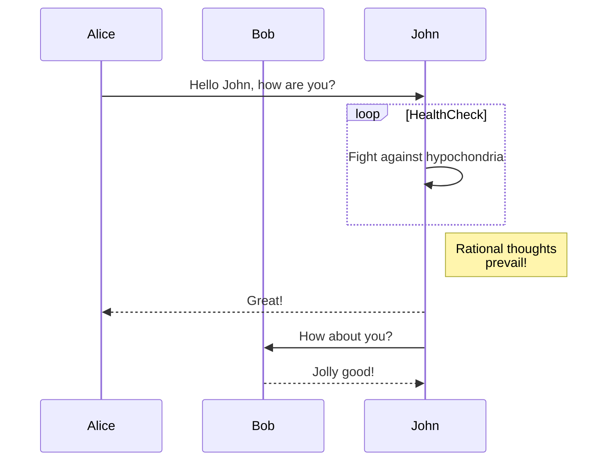

# 対応するMarkdown記法

`Markdown`には様々な書き方があります。

ここでは、本拡張機能が対応するMarkdown記法を紹介します。

## ヘッダー

### 書き方

```
# h1
## h2
### h3
#### h4
##### h5
###### h6
```

### 結果

# h1

## h2

### h3

#### h4

##### h5

###### h6

## 数式

### 書き方

```plaintext
文中に挿入するなら$e^{jx} = \cos x + j \sin x$のように。
$$
\begin{aligned}
    \cos x &= \sum_{n=0}^{\infty} \frac{(-1)^{n}}{(2n)!}x^{2n} \\
    \sin x &= \sum_{n=0}^{\infty} \frac{(-1)^{n}}{(2n+1)!}x^{2n+1}
\end{aligned}
$$
```

### 結果

文中に挿入するなら$e^{jx} = \cos x + j \sin x$のように。

$$
\begin{aligned}
    \cos x &= \sum_{n=0}^{\infty} \frac{(-1)^{n}}{(2n)!}x^{2n} \\
    \sin x &= \sum_{n=0}^{\infty} \frac{(-1)^{n}}{(2n+1)!}x^{2n+1}
\end{aligned}
$$

## コードブロック

### 書き方

```js showLineNumbers title="add.js" {3}
const add = (a, b) => a + b;
add(2, 3); // 5
add(4, 5); // 9
```

### 結果

```js showLineNumbers title="add.js" {3}
const add = (a, b) => a + b;
add(2, 3); // 5
add(4, 5); // 9
```

## iframe生成

### 書き方

```plaintext
https://www.youtube.com/watch?v=G1W3aroArqY

https://youtu.be/G1W3aroArqY?si=ikN7z2VwhoprUT8M

https://youtu.be/G1W3aroArqY
```

### 結果

https://www.youtube.com/watch?v=G1W3aroArqY

https://youtu.be/G1W3aroArqY?si=ikN7z2VwhoprUT8M

https://youtu.be/G1W3aroArqY

## Admonition・Alert記法

:::::tabs
::::tab[info]

    ### 書き方

    ```plaintext
    :::info
    複数行でもOKです。
    - リストも
    - 書けます

    **Markdownの書式**も使えます。
    :::

    :::info[Special Title]
    複数行でもOKです。
    - リストも
    - 書けます

    **Markdownの書式**も使えます。
    :::
    ```

    ### 結果

    :::info
    複数行でもOKです。
    - リストも
    - 書けます

    **Markdownの書式**も使えます。
    :::

    :::info[Special Title]
    複数行でもOKです。
    - リストも
    - 書けます

    **Markdownの書式**も使えます。
    :::

::::

::::tab[tip]

    ### 書き方

    ```plaintext
    :::tip
    複数行でもOKです。
    - リストも
    - 書けます

    **Markdownの書式**も使えます。
    :::

    :::tip[Special Title]
    複数行でもOKです。
    - リストも
    - 書けます

    **Markdownの書式**も使えます。
    :::
    ```

    ### 結果

    :::tip
    複数行でもOKです。
    - リストも
    - 書けます

    **Markdownの書式**も使えます。
    :::

    :::tip[Special Title]
    複数行でもOKです。
    - リストも
    - 書けます

    **Markdownの書式**も使えます。
    :::

::::

::::tab[warning]

    ### 書き方

    ```plaintext
    :::warning
    複数行でもOKです。
    - リストも
    - 書けます

    **Markdownの書式**も使えます。
    :::

    :::warning[Special Title]
    複数行でもOKです。
    - リストも
    - 書けます

    **Markdownの書式**も使えます。
    :::
    ```

    ### 結果

    :::warning
    複数行でもOKです。
    - リストも
    - 書けます

    **Markdownの書式**も使えます。
    :::

    :::warning[Special Title]
    複数行でもOKです。
    - リストも
    - 書けます

    **Markdownの書式**も使えます。
    :::

::::

::::tab[danger]

    ### 書き方

    ```plaintext
    :::danger
    複数行でもOKです。
    - リストも
    - 書けます

    **Markdownの書式**も使えます。
    :::

    :::danger[Special Title]
    複数行でもOKです。
    - リストも
    - 書けます

    **Markdownの書式**も使えます。
    :::
    ```

    ### 結果

    :::danger
    複数行でもOKです。
    - リストも
    - 書けます

    **Markdownの書式**も使えます。
    :::

    :::danger[Special Title]
    複数行でもOKです。
    - リストも
    - 書けます

    **Markdownの書式**も使えます。
    :::

::::

:::::

## タブ記法

### 書き方

```plaintext
::::tabs

  :::tab[タブ1のタイトル]
  タブ1の内容がここに表示されます。
  複数行でもOKです。
  - リストも
  - 書けます

  **Markdownの書式**も使えます。
  :::

  :::tab[タブ2のタイトル]
  タブ2の内容がここに表示されます。
  複数行でもOKです。
  - リストも
  - 書けます

  **Markdownの書式**も使えます。
  :::

::::
```

### 結果

::::tabs

:::tab[タブ1のタイトル]
タブ1の内容がここに表示されます。
複数行でもOKです。

- リストも
- 書けます

**Markdownの書式**も使えます。
:::

:::tab[タブ2のタイトル]
タブ2の内容がここに表示されます。
複数行でもOKです。

- リストも
- 書けます

**Markdownの書式**も使えます。
:::

::::

## 折り畳み

:::::tabs

::::tab[推奨]

### 書き方

```plaintext
:::details
  折りたたまれていた内容がここに表示されます。
  複数行でもOKです。
  - リストも
  - 書けます

  **Markdownの書式**も使えます。
:::

:::details[タイトル付]
  折りたたまれていた内容がここに表示されます。
  複数行でもOKです。
  - リストも
  - 書けます

  **Markdownの書式**も使えます。
:::
```

### 結果

:::details
折りたたまれていた内容がここに表示されます。
複数行でもOKです。- リストも - 書けます

    **Markdownの書式**も使えます。

:::

:::details[タイトル付]
折りたたまれていた内容がここに表示されます。
複数行でもOKです。- リストも - 書けます

    **Markdownの書式**も使えます。

:::

::::

:::tab[HTML版]

### 書き方

```plaintext
<details>
  <summary>ここをクリックして展開</summary>

  折りたたまれていた内容がここに表示されます。
  複数行でもOKです。
  - リストも
  - 書けます

  **Markdownの書式**も使えます。
</details>
```

### 結果

  <details>
    <summary>ここをクリックして展開</summary>

    折りたたまれていた内容がここに表示されます。
    複数行でもOKです。
    - リストも
    - 書けます

    **Markdownの書式**も使えます。

  </details>

:::

:::::

## Mermaid

### 書き方

````plaintext

````

### 結果


## ABC.js

### 書き方

````plaintext
```abc
X:1
T:Demo Song
C:Kashiwade
M:6/8
L:1/8
K:Bm
Q:1/4=175
%%staves  {(rh) (lh)}
V:rh clef=treble 
V:lh clef=treble
% Start of the melody
[V:rh]
fefcBe | fcBafe | fefcBe | fcBabf |
[V:lh]
G,2D2F2 | G,2D2E2 | G,2D2F2 | G,2D2E2 |
% next line
[V:rh]
edeABd | edeafd | edeABd | [ec]d[fA]B[ec]2 |
[V:lh]
F,2A,2C2 | F,2A,2E2 | F,2A,2C2 | F,2A,2E2 |
%next line
[V:rh]
[fB]efcBe | fcBafe | fefcBe | fcBabd' |
[V:lh]
G,2D2F2 | G,2D2E2 | G,2D2F2 | G,2D2E2 |
%next line
[V:rh]
c'd'caAf | e2dAc2 | c2d2-dA | c2d4 :|
[V:lh]
F,2A,2C2 | F,2C2A2 | B,2D2F2- | FAFEB,2 :|
```
````

### 結果

```abc
X:1
T:Demo Song
C:Kashiwade
M:6/8
L:1/8
K:Bm
Q:1/4=175
%%staves  {(rh) (lh)}
V:rh clef=treble 
V:lh clef=treble
% Start of the melody
[V:rh]
fefcBe | fcBafe | fefcBe | fcBabf |
[V:lh]
G,2D2F2 | G,2D2E2 | G,2D2F2 | G,2D2E2 |
% next line
[V:rh]
edeABd | edeafd | edeABd | [ec]d[fA]B[ec]2 |
[V:lh]
F,2A,2C2 | F,2A,2E2 | F,2A,2C2 | F,2A,2E2 |
%next line
[V:rh]
[fB]efcBe | fcBafe | fefcBe | fcBabd' |
[V:lh]
G,2D2F2 | G,2D2E2 | G,2D2F2 | G,2D2E2 |
%next line
[V:rh]
c'd'caAf | e2dAc2 | c2d2-dA | c2d4 :|
[V:lh]
F,2A,2C2 | F,2C2A2 | B,2D2F2- | FAFEB,2 :|
```
