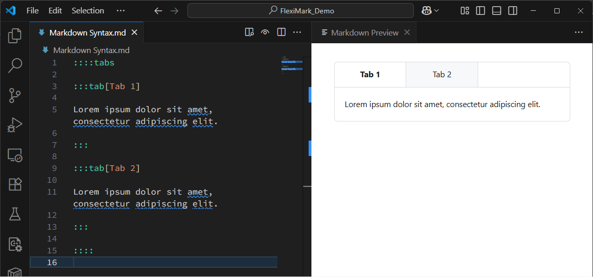
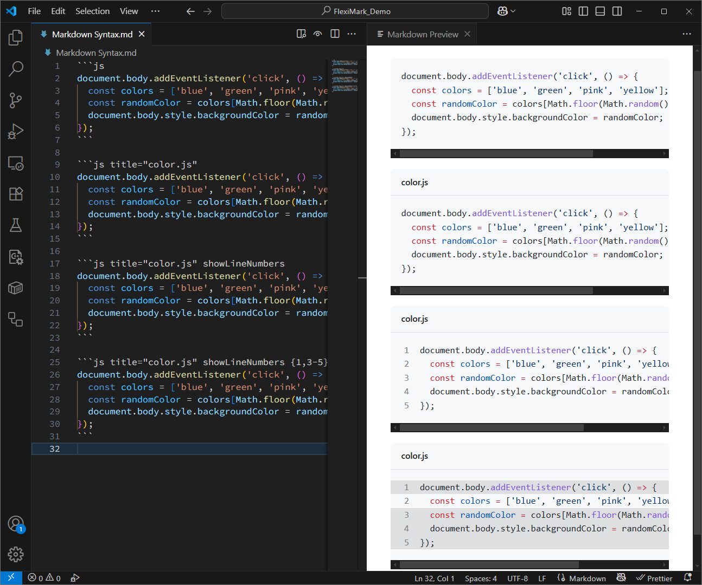
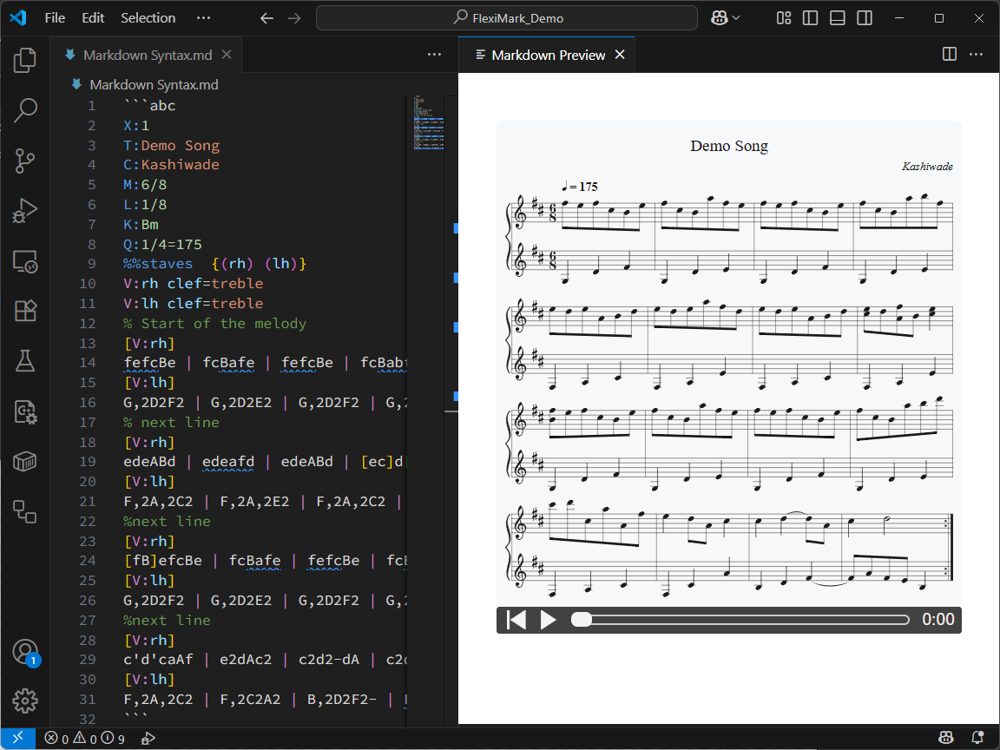
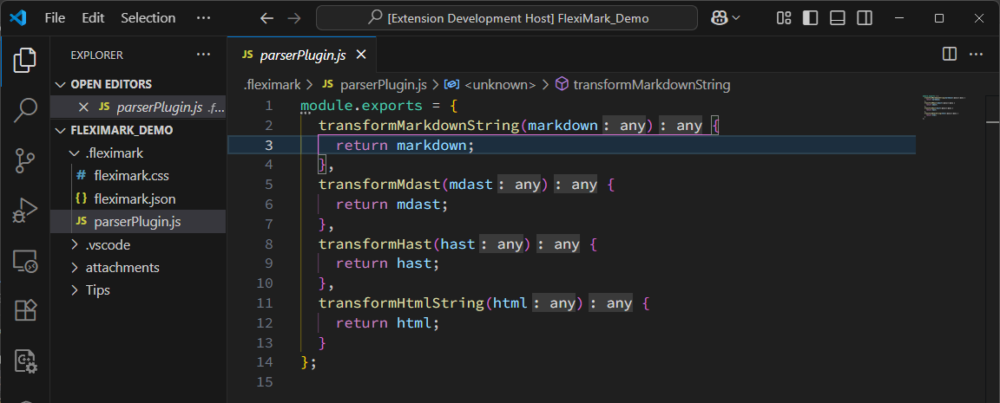

<div align="center">
  
  <h1>FlexiMark</h1>
  <p><strong>Next-Level Markdown Preview and Note-Taking for VSCode</strong></p>

  <p>
    <a href="https://marketplace.visualstudio.com/items?itemName=kashiwade.fleximark">
      
    </a>
  </p>
</div>


## 🚀 Overview

**FlexiMark** is a powerful, extensible Markdown toolkit for Visual Studio Code that redefines what Markdown editing and previewing can be.

With seamless live preview capabilities both _inside VSCode_ and _in your web browser_, FlexiMark gives you complete freedom over customization, interactivity, and style — using the full power of JavaScript.

Whether you're a developer, writer, student, or researcher, FlexiMark is designed to supercharge your Markdown experience — especially for taking structured, rich notes.

## ✨ Key Features

### 🔁 **Live Preview**

- **VSCode Live Preview**: View your Markdown instantly as you type.
  
- **Web Browser Preview**: Render your Markdown in any browser and execute JavaScript as you like.
  
  - Use custom scripts, libraries, and styling freely.
  - Unmatched flexibility for interactive content and rendering.

### 🧩 **Flexible File Generation**

- Auto-generate **customizable directory structures** based on your category tree.
- Configure **prefixes and suffixes** for filenames.
- Choose from **multiple, customizable templates** when creating new notes.
- Get organized without the overhead.


### 🧪 **Enhanced Markdown Features**

Built on GitHub Flavored Markdown (GFM) with powerful additions:

- **Admonitions**: Add notes, tips, warnings, and danger.
  
- **Tabs**: Neatly organize content.
  
- **Collapsible Sections**: An alternative to the HTML `<details>` tag
  
- **YouTube iframe**:
  
- **Flexible Code Block**: In addition to syntax highlighting, FlexiMark supports code block titles, line numbers, and line highlighting.
  
- **Mermaid Diagrams**: Create flowcharts, sequences, and more.
  
  Uses [this extension](https://marketplace.visualstudio.com/items?itemName=bpruitt-goddard.mermaid-markdown-syntax-highlighting) for syntax highlighting.
- **ABC Notation**:
  
  - Realtime render and **play sheet music** in Markdown.
  - Supports **live preview**, **syntax highlighting**, and **useful snippets**.

### 🔧 **Other Useful Features**

- Export to Portable HTML files
- Extending Markdown Syntax
  
- Collect Admonitions/Alerts under specific categories
  

## 🧰 Ideal For

- Developers maintaining technical notes or documentation.
- Writers and researchers building structured content.
- Musicians using abc notation.
- Anyone wanting a smarter, more interactive Markdown workflow.

## 📦 Installation

Available via the [VSCode Marketplace](https://marketplace.visualstudio.com/items?itemName=Kashiwade.fleximark) or install manually:

```bash
code --install-extension kashiwade.fleximark
```

## 🚀 Getting Started

1. **Set up a new workspace** for your FlexiMark notes.

   > If you're migrating from the VSCode Note Taking Extension, use the [Migration Tool](https://github.com/Kashiwade-music/fleximark-migration-tool) to carry over your existing notes.

2. Open the **VSCode Command Palette** and run:
   `FlexiMark: Initialize Workspace as Note Taking Directory`

3. Customize your note categories in the generated configuration file.

4. Start writing! Use the Command Palette and select:
   `FlexiMark: Create New Note`

## 📚 Documentation

Detailed guides, configuration options, and templates are available in the [**WIP**](#).

## 💬 Feedback & Contributions

FlexiMark is open source and welcomes contributions!
Found a bug or have a feature request? [Open an issue](#) or submit a pull request.

## 📄 License

MIT License. See [LICENSE](./LICENSE) for more details.

---

FlexiMark — _Take Markdown Notes. Preview Your Way._
