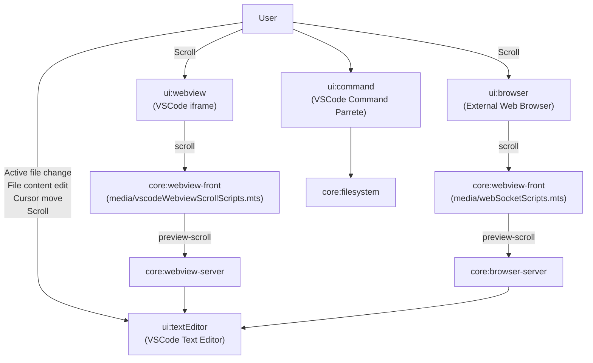

# FlexiMark

## How to

### Pack

```
npx @vscode/vsce package
```

### Publish

```
npx @vscode/vsce publish
```

### l10n

After replacing the extensions of all `*.mts` files under `src` with `.ts`, run the following command.

```
npx @vscode/l10n-dev export --outDir ./l10n ./src
```

### Tests

change `package.json` 

```json
  "activationEvents": [
    "onLanguage:markdown",
    "*"
  ],
```

then,

```
npm test
```

## Project Diagram
wip

