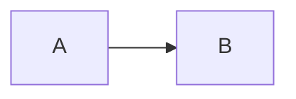

# FlexiMark

## 開発環境

### 設計資料

- [Current architecture](ARCHITECTURE.md)
- [Completion roadmap](ROADMAP.md)

### 必要なもの

- VS Code 1.137.0 以降
- Node.js 24.21.0 と npm 12.0.2（`package.json` の指定に合わせる）
- Rust 1.85 以降
- Git

Rust/Wasmtime の初回 build は `target` に数 GB の空き容量を必要とする。空き容量が
100 MB 程度しかない状態では linker が長時間停止したように見えたり、build が失敗したりするため、
先に十分な空き容量を確保する。

### 依存関係のインストール

```sh
npm ci
```

## Extension Development Host での手動動作確認

以下は、ソースから build した拡張機能について、人間が主要 user flow を一巡する手順である。
開発リポジトリそのものを検証用 workspace にせず、別の空ディレクトリを用意して行う。

### 1. daemon と拡張機能を build する

リポジトリのルートで次を実行する。

```sh
npm run build:daemon
npm run build:adapter
```

`build:daemon` は release build した実行ファイルを、現在の platform/CPU に対応する
`bin/<platform>-<arch>/fleximarkd`（Windows は `.exe`）へコピーする。現在の配布対象は
Windows/Linux/macOS の x64 である。

VS Code でこのリポジトリを開き、Run and Debug から `Run Extension` を選んで F5 を押す。
既定の build task が TypeScript と adapter bundle の watch を開始し、別ウィンドウの
Extension Development Host が開く。

Rust を変更した場合は、先に実行中の Extension Development Host を停止し、次を再実行してから
F5 で起動し直す。Windows では実行中の daemon を上書きできないため、停止が先である。

```sh
cargo build --release -p fleximarkd
node scripts/stage-daemon.mjs
```

### 2. 検証用 workspace を初期化する

1. 任意の空ディレクトリ（例: `fleximark-manual-check`）を作る。
2. Extension Development Host で `File: Open Folder...` を実行し、そのディレクトリを開く。
3. Workspace Trust の確認が出た場合は、この検証用ディレクトリを信頼する。
4. Command Palette から
   `FlexiMark: Initialize Workspace as Note Taking Directory` を実行する。
5. `.fleximark/config.toml` と `.fleximark/theme.css` が作られ、`config.toml` が開くことを確認する。

書き込み系 command（初期化、note、theme、admonition collection、export）は trusted workspace
でのみ動く。複数の workspace folder があり、active editor から対象を決められない場合は、
対象 workspace を選ぶ Quick Pick が表示される。

### 3. Markdown と preview を確認する

workspace 直下に `sample.md` を作り、次の内容を保存する。

````markdown
# FlexiMark manual check

通常の **Markdown** と [link](https://example.com)。

:::info[Important]
This admonition must appear in the preview.
:::

::::tabs
:::tab[First]
First tab
:::
:::tab[Second]
Second tab
:::
::::

:::details[Details]
Expandable content
:::


```mermaid
graph LR; A --> B
```

```abc
X:1
T:Scale
M:4/4
L:1/4
K:C
C D E F | G A B c |
```
````

`sample.md` を active editor にして、次を確認する。

1. Command Palette から `FlexiMark: Preview in VSCode` を実行する。
2. heading、admonition、tabs、details、Mermaid、ABC が表示される。
3. ファイルを保存せずに新しい heading（例: `## Unsaved edit`）を追加し、preview が更新される。
4. 短時間に数回編集しても、以前の内容へ巻き戻る表示や古い diagnostics が出ない。
5. editor の cursor と scroll を動かし、preview の対応箇所が追従する。
6. preview 内の heading をクリックし、editor の対応範囲へ selection が移る。
7. `FlexiMark: Force Reload Preview` を実行しても同じ内容に復旧する。
8. `FlexiMark: Preview in Browser` を実行し、既定ブラウザでも同じ文書が開く。

既定 preview の切替は Settings の `FlexiMark: Preview Target`、自動表示は
`FlexiMark: Auto Open Preview` で確認できる。

### 4. editor feature を確認する

`sample.md` で次を確認する。

1. `:::` または code fence を入力し、completion が表示される。
2. Outline view または `Go to Symbol in Editor...` に Markdown heading が表示される。
3. 問題のある構文で diagnostic が出た場合、Problems view と Quick Fix が同じ文書位置を指す。
4. 日本語や emoji を heading に加えても、selection と symbol の位置がずれない。

### 5. workspace theme を確認する

1. `FlexiMark: Edit Workspace Theme` を実行し、`.fleximark/theme.css` が開くことを確認する。
2. 例えば `body { border-top: 4px solid #d33682; }` を追記して保存する。
3. 開いている preview が再構成され、指定した見た目が反映されることを確認する。
4. 確認後は追記を戻してよい。

### 6. note creation を確認する

生成済み `.fleximark/config.toml` の末尾へ、必要なら次を追加して保存する。

```toml
[notes]
file_name_prefix = "${CURRENT_YEAR}-"
file_name_suffix = "-draft"

[notes.categories]
reports = "work/reports"

[notes.templates]
daily = ["# ${1:Title}", "Created ${CURRENT_YEAR}-${CURRENT_MONTH}-${CURRENT_DATE}", "$0"]
```

`FlexiMark: Create New Note` を実行し、category に `reports`、template に `daily` を選ぶ。
`notes/work/reports/` に日付展開済みの Markdown が作られ、そのファイルが editor で開くことを確認する。
選択肢を設定していない場合は、`notes/` に `# New note` の note が作られる。

### 7. admonition collection を確認する

`sample.md` を active editor に戻し、`FlexiMark: Collect admonitions/alerts and compile them into a single Markdown file`
を実行する。`notes/admonitions-<timestamp>.md` が作られて開き、admonition 本体だけが収集され、
通常の段落や tabs の内容が混入していないことを確認する。

### 8. HTML export を確認する

1. `sample.md` を active editor にして `FlexiMark: Export as HTML` を実行する。
2. `sample.fleximark-export/index.html` が作られて開くことを確認する。
3. export directory に `.fleximark-export.json` があり、必要な local asset が `assets/` に複製されることを確認する。
4. `index.html` をブラウザで開き、VS Code preview と主要な表示が一致することを確認する。
5. 文書を変更して再度 export し、管理済み directory が次の generation に安全に更新されることを確認する。

既定の `raw_html_export` は `reject` である。raw HTML を含む文書を export した場合の拒否は
意図した動作である。また、同名の export directory が FlexiMark 管理外の非空 directory の場合も、
既存ファイル保護のため export は拒否される。

### 9. daemon crash recovery を確認する

1. `sample.md` と VS Code preview を開いたまま、保存していない heading を追加する。
2. Extension Development Host の terminal または OS の process manager から、検証中の
   `fleximarkd` process を終了する。Windows PowerShell の例:

   ```powershell
   Get-Process fleximarkd | Stop-Process -Force
   ```

   Linux/macOS の例:

   ```sh
   pkill -f 'fleximarkd lsp'
   ```

3. status bar に reconnect 中の表示、その後 `FlexiMark recovered` が出ることを確認する。
4. `View: Toggle Output` を開いて `FlexiMark` channel を選び、同じ recovery ID で exit、retry、
   新しい daemon generation、replayed document/preview 数が記録されていることを確認する。
5. 保存していない heading が editor に残り、preview にも再表示されることを確認する。
6. 復旧後にさらに編集し、preview、Outline、completion が引き続き動くことを確認する。

`fleximarkd` を使う別の開発セッションが同時にある場合、上の一括終了 command は使わず、Task Manager
などで Extension Development Host の子 process だけを終了する。

### 10. multi-root を確認する

1. `File: Add Folder to Workspace...` で2つ目の検証用 folder を追加する。
2. 両方の folder に Markdown を置き、それぞれ `Preview in VSCode` を開く。
3. daemon を一度終了し、両方の unsaved buffer と preview が復旧することを確認する。
4. 片方の folder を workspace から remove し、その folder の preview だけが閉じ、もう片方が動き続けることを確認する。

### 11. ログと終了条件

確認中は Output の `FlexiMark` channel と Problems view を見る。次を満たせば手動確認は完了とする。

- preview、unsaved edit、selection/navigation が動く
- workspace theme、note、admonition collection、HTML export が動く
- daemon crash 後に open buffer と preview が復旧する
- blocker となる error notification、古い結果の再表示、別 workspace への書き込みがない

## VSIX をインストールして確認する

Extension Development Host は開発 bundle の確認であり、最終 package 内容の確認ではない。
配布物も確認する場合は次を実行する。

```sh
npm run package:vsix -- --out fleximark-dev.vsix
code --install-extension fleximark-dev.vsix --force
```

通常の VS Code window を新しく開き、上記「2」から「9」の主要 flow を繰り返す。確認後に開発版を
削除する場合は `code --uninstall-extension Kashiwade.fleximark` を実行する。普段使用している同名拡張を
上書きしたくない場合は、専用の VS Code Profile または一時 user-data directory を使う。

## トラブルシューティング

- `spawn ... fleximarkd ENOENT`: `npm run build:daemon` を再実行し、`bin/<platform>-<arch>/` を確認する。
- 別の daemon を直接使う: Settings の `FlexiMark: Daemon Path` に絶対パスを指定し、window を reload する。
- TypeScript 変更が反映されない: F5 セッションを停止し、`npm run build:adapter` 後に再起動する。
- Rust 変更が反映されない: F5 セッションを停止し、release build と `stage-daemon.mjs` を再実行する。
- command が書き込みを拒否する: folder を workspace として開いたこと、Workspace Trust、
  `.fleximark/config.toml` の `schema_version = 1` を確認する。
- preview が開かない、または復旧しない: Output の `FlexiMark` channel で launch/recovery ID と
  daemon stderr を確認し、必要なら `Developer: Toggle Developer Tools` の Console も確認する。

## 自動検証

```sh
npm run verify:all
```

`verify:all` runs the TypeScript and Rust checks, builds release assets, checks
the architecture inventory and performance budgets, and runs the VS Code
integration suite. Use `npm run verify` for the faster packaging prerequisite.

Linux では VS Code integration test を Xvfb 上で実行する。

```sh
xvfb-run -a npm test
```

## Package

```sh
npm run package:vsix
```

The VSIX file list can be inspected before publishing:

```sh
npm exec vsce ls
```

## Localization

Source files use `.mts` directly. No temporary renaming is required.

```sh
npm run l10n:export
npm run l10n:check
```

Commit the generated English bundle and update the translated bundles in the
same change. CI rejects stale localization output.

## Release

Merges to `main` are validated before semantic-release runs. A successful
release creates one VSIX, attests it, attaches it to the GitHub Release, and
publishes that exact file to Visual Studio Marketplace with OIDC trusted
publishing. Configure the `vscode-marketplace` GitHub Environment and a matching
trusted publisher policy in Marketplace before the first release.

Publishing is intentionally performed only by GitHub Actions; local PAT-based
publishing is not part of the release process.

## Repository setup

GitHub settings that cannot be stored in this repository must match the
workflows:

- protect `main` with a ruleset that requires `Validate extension`,
  `Dependency review`, and `Analyze JavaScript and TypeScript`;
- enable Dependabot alerts and security updates;
- create the `vscode-marketplace` Environment;
- register a Visual Studio Marketplace trusted publisher for
  `Kashiwade-music/fleximark`, workflow `release.yml`, environment
  `vscode-marketplace`.

## Project Structure


