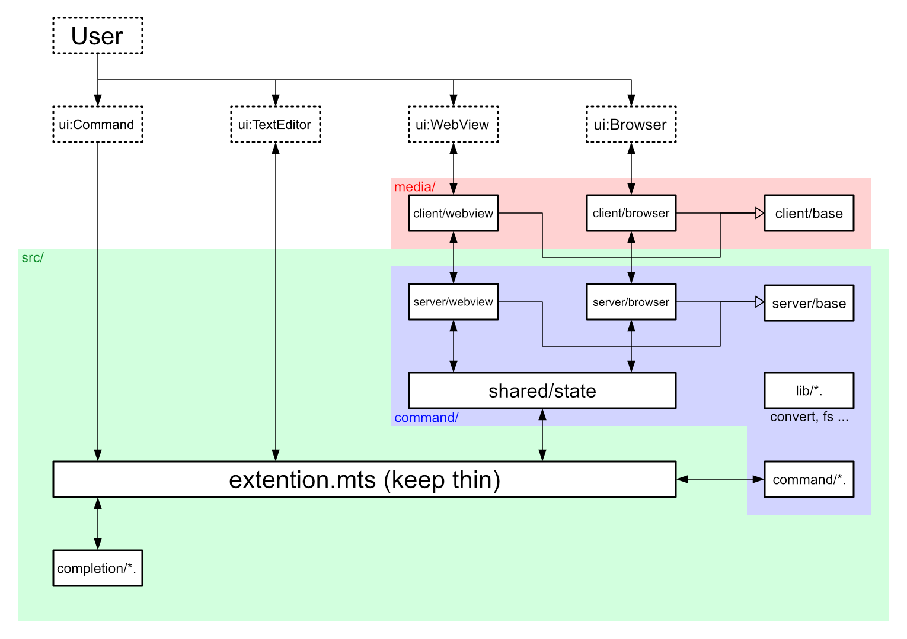

# FlexiMark

## How to

### Install

```sh
npm ci
```

### Validate

```sh
npm run check-types
npm run lint
npm run build
npm test
```

On Linux, run the VS Code integration tests under Xvfb:

```sh
xvfb-run -a npm test
```

### Package

```sh
npm run package:vsix
```

The VSIX file list can be inspected before publishing:

```sh
npm exec vsce ls
```

### Localization

Source files use `.mts` directly. No temporary renaming is required.

```sh
npm run l10n:export
npm run l10n:check
```

Commit the generated English bundle and update the translated bundles in the
same change. CI rejects stale localization output.

### Release

Merges to `main` are validated before semantic-release runs. A successful
release creates one VSIX, attests it, attaches it to the GitHub Release, and
publishes that exact file to Visual Studio Marketplace with OIDC trusted
publishing. Configure the `vscode-marketplace` GitHub Environment and a matching
trusted publisher policy in Marketplace before the first release.

Publishing is intentionally performed only by GitHub Actions; local PAT-based
publishing is not part of the release process.

### Repository setup

GitHub settings that cannot be stored in this repository must match the
workflows:

- protect `main` with a ruleset that requires `Validate extension`,
  `Dependency review`, and `Analyze JavaScript and TypeScript`;
- enable Dependabot alerts and security updates;
- create the `vscode-marketplace` Environment;
- register a Visual Studio Marketplace trusted publisher for
  `Kashiwade-music/fleximark`, workflow `release.yml`, environment
  `vscode-marketplace`.

## Project Structure


